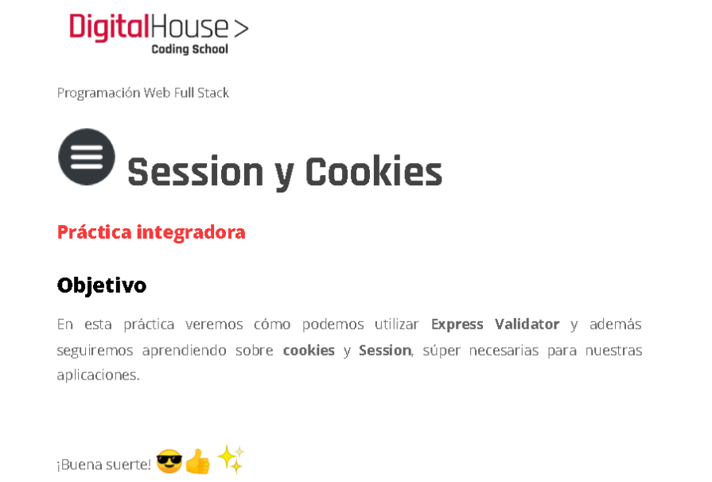

<figure></figure>

 ## Instrucciones

Para ejecutar el proyecto, sigue estos pasos:

1. Clona el repositorio en tu máquina local utilizando el siguiente comando:

```bash
git clone https://github.com/Aubar48/sessionAndCookies
```

2. Navega hasta el directorio del proyecto:

```bash
cd sessionAndCookies-master
```

3. Instala las dependencias del proyecto con el siguiente comando:

```bash
npm install
```

4. Inicia el servidor de desarrollo ejecutando el siguiente comando:

```bash
node app
```